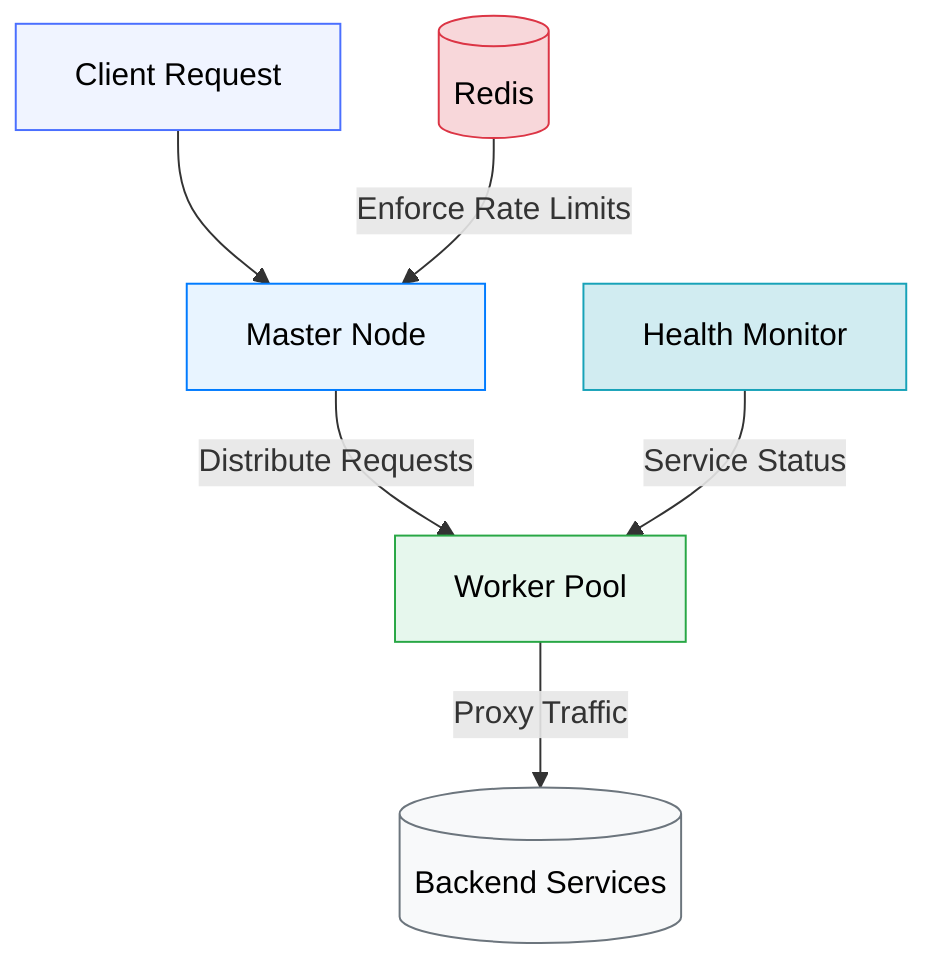

# Reverse Proxy Server

A reverse proxy server with load balancing, rate limiting, and health checking capabilities. Built with Node.js and designed for cloud-native deployments.

## Architecture


## Features

- **Load Balancing** (Round Robin, Random, Least Connections)
- **Rate Limiting** with Redis integration
- **Health Checking** of backend services
- **YAML-based Configuration**
- **Cluster Worker Model** for vertical scaling
- **Header Manipulation** capabilities
- **Path-based Routing** rules
- **Multiple Upstream** support

### Requirements
- Node.js 18+ & npm
- Redis 6+ (local or cloud instance)
- Unix-like environment (Windows requires WSL2)

## Installation

1. Clone repository:
```bash
git clone https://github.com/yourusername/reverse-proxy.git
cd reverse-proxy
```
2. Install dependencies:
```bash
npm install
```


## Configuration Options

| **Option**    | **Description** |
|--------------|----------------|
| **`listen`**  | Port for the reverse proxy to listen on |
| **`workers`** | Number of worker processes |
| **`forwards`** | List of backend services with their URLs |
| **`headers`**  | Custom headers to be added to forwarded requests |
| **`rules`** | Path-based routing rules defining how requests are forwarded |


## Usage Example
🔹 **Access through reverse proxy**  
```bash
http://localhost:8000/
```
🔹 **Access admin route**
```bash
http://localhost:8000/admin
```


